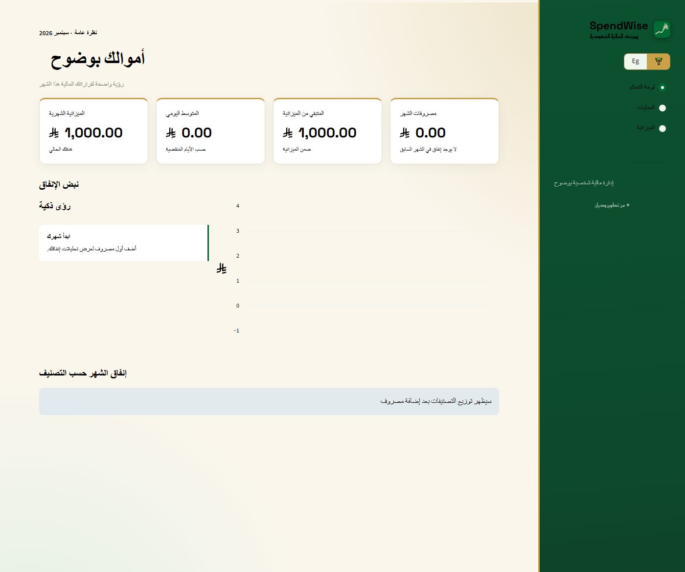
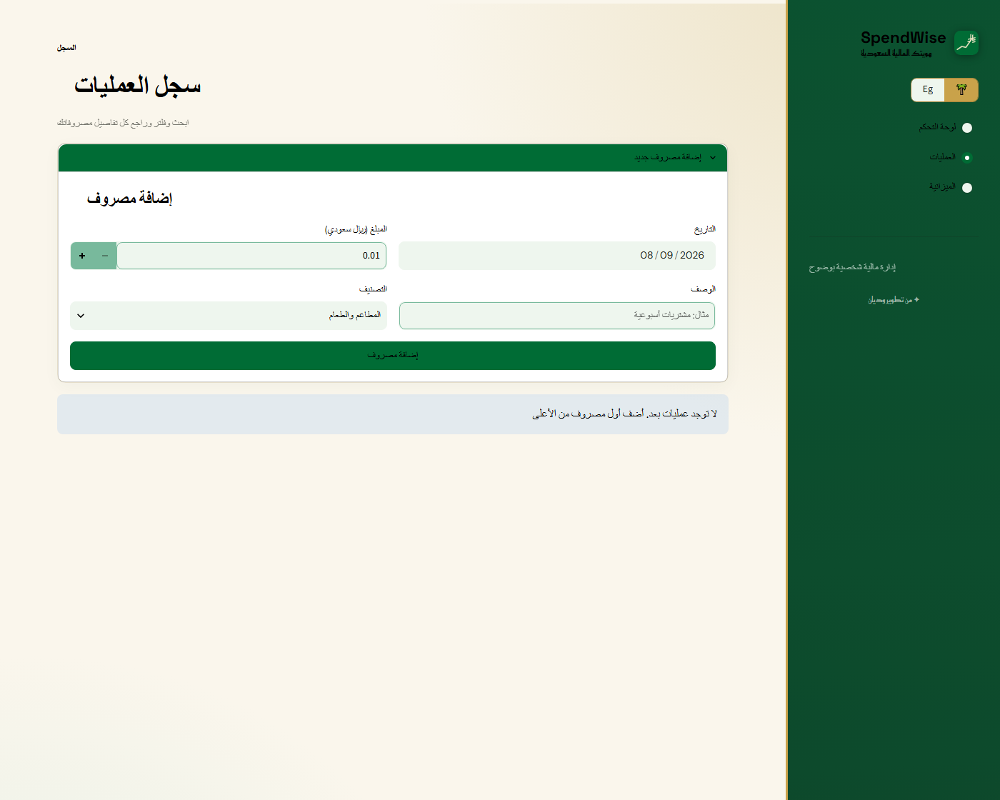
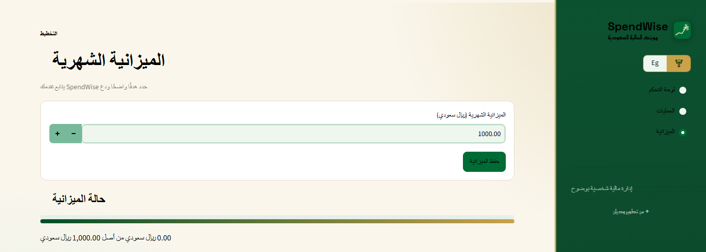

# SpendWise

تطبيق ويب لإدارة المصاريف الشخصية وتتبع الميزانية الشهرية، مبني بهوية سعودية بالكامل (الألوان، الرمز الرسمي للريال السعودي، دعم كامل للغة العربية باتجاه RTL) مع دعم ثنائي اللغة (عربي / إنجليزي).

Personal finance and budget tracking app built with Streamlit, featuring a full Saudi visual identity (colors, the official Saudi Riyal symbol, full Arabic RTL support) alongside bilingual Arabic/English support.

## المزايا / Features

- **لوحة تحكم** تعرض مصروفات الشهر، المتبقي من الميزانية، المتوسط اليومي، ورؤى ذكية تلقائية عن أنماط الإنفاق.
- **سجل عمليات** لإضافة، تعديل، حذف، والبحث والفلترة في المصاريف حسب التصنيف والشهر.
- **تصنيفات مرنة**: تصنيفات جاهزة، مع خيار "أخرى" لكتابة تصنيف مخصص.
- **ميزانية شهرية** قابلة للتعديل مع شريط تقدم يوضح مقدار الإنفاق منها.
- **رمز الريال السعودي الرسمي** مستخدم في كل مكان تظهر فيه المبالغ.
- **دعم كامل للعربية والإنجليزية** مع تبديل فوري للاتجاه (RTL/LTR).

## لقطات من التطبيق / Screenshots

### لوحة التحكم / Dashboard

### سجل العمليات / Transactions

### الميزانية الشهرية / Budget

> 📌 هذا مستودع عرض فقط (Showcase) — الكود المصدري خاص وغير منشور هنا.
> This is a showcase repo only — the source code is private and not published here.

## التقنيات المستخدمة / Tech stack

- [Streamlit](https://streamlit.io/) — واجهة التطبيق
- [Plotly](https://plotly.com/python/) — الرسوم البيانية
- [pandas](https://pandas.pydata.org/) — معالجة البيانات
- SQLite — قاعدة البيانات المحلية
